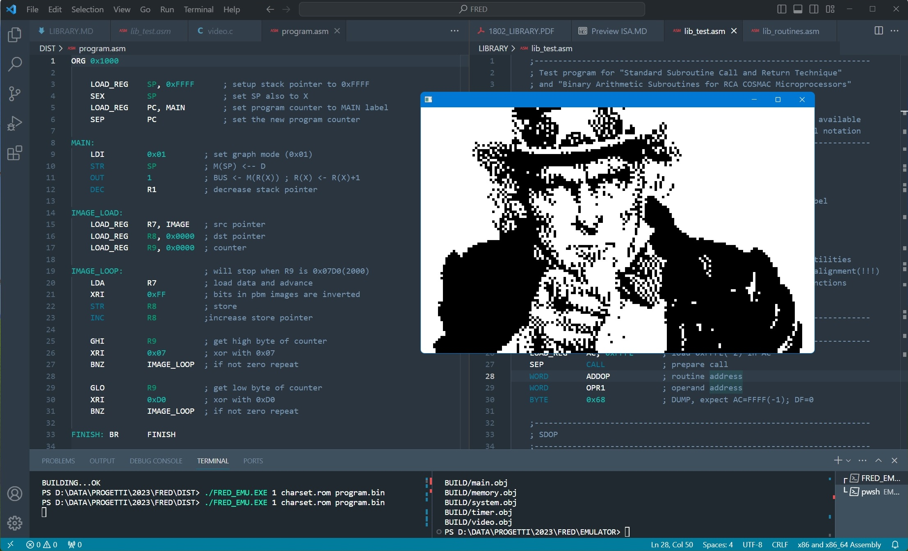

# (SUPER) FRED

SUPER FRED is a system based on the RCA CDP 1802 processor designed by Joseph Weisbecker.

The purpose of this project is to provide the tools needed to run a "modernized" and "simplified" version of a system based on this processor.

This repository contain an assembler and an emulator to develop and run programs for such system.

Both tools have been build from scratch in C language.

## SYSTEM DESCRIPTION

The system emulate the following components :
```
- CPU       : RCA CDP1802

- MEMORY    : 64 KB

- VIDEO     : text mode 40x25 characters, 16 colors
            : graph mode 160x100 pixels, 2 colors

- KEYBOARD  : standard keyboard

- TIMER     : activation 16.6 times per second

- SOUND     : 48 tones speaker
```

For details of specifications refer to the [SPECS](DOCS/SPECS.MD) section.


## PROJECT STRUCTURE

```
FRED
|
├── ASSEMBLER
|   ├── BUILD
|   ├── SRC
|   ├── Debug.bat
|   └── CMakeLists.txt
|
├── EMULATOR
|   ├── BUILD
|   ├── SRC
|   ├── EXT
|   |   ├── INCLUDE
|   |   |   ├── GL
|   |   |   ├── GLFW
|   |   |   └── OPENAL
|   |   └── LIB
|   |       ├── GL
|   |       ├── GLFW
|   |       └── OPENAL
|   ├── Debug.bat
|   └── CMakeLists.txt
|
├── DOCS
|   ├── 1802_EXTRA.PDF
|   ├── 1802_MANUAL.PDF
|   ├── ASM.MD
|   ├── ISA.MD
|   ├── MACRO.MD
|   └── SPECS.MD
|
├── DIST
│   ├── charset.rom
|   ├── program.bin
|   ├── program.asm
|   ├── FRED_ASM.EXE
|   ├── FRED_EMU.EXE
|   ├── glfw3.dll
|   ├── OpenAL32.dll
|   └── soft_oal.dll
|
└── README.MD
```
**NOTE :<BR>
The "DIST" folder contains the binary distribution of the project, with precompiled assembler and emulator.<BR>
In the same folder are also provided all the required DLLs, a sample character set, and a sample program (with asm source) for the emulator**

## ASSEMBLER

To invoke the assembler use :
```
FRED_ASM.EXE INPUT_FILE OUTPUT_FILE
```
where :

```
INPUT_FILE  : your assembly source code
OUTPUT_FILE : binary file output
```

## EMULATOR

In order to run the emulator, in the same folder of the executable must be present the following files :
```
- glfw3.dll
- OpenAL32.dll
- soft_oal.dll
```

To invoke the emulator with custom parameters use :
```
FRED_EMU.EXE CPU_MHZ CHARSET_FILE PROGRAM_FILE
```
where :

```
CPU_MHZ      : the speed of the cpu in Mhz
CHARSET_FILE : your custom charset file
PROGRAM_FILE : your binary program
```


## BUILDING

To build the assembler and/or the emulator from source open a console like : 

```
Native Tools Command Prompt for VS 2022
```

and run one of the following commands in the according folder :

```
Debug.bat /* for command line */ 
```
or
```
cmake -B BUILD /* for cmake */
```

## PROGRAMMING

The assembler use a two steps approach without intermediate files.

The full reference of the CDP1802 instruction set is documented in the [ISA](DOCS/ISA.MD) section.

Some simple macros are available in the [MACRO](DOCS/MACRO.MD) section.

The library reference for standard routines is available in the [LIBRARY](LIBRARY/LIBRARY.MD) section.

Basic informations and several code snippets are provided in the [ASM](DOCS/ASM.MD) section.

## DEVELOPMENT

The project is nearly completed, eventually i will add dma functionalities for block devices.
Stay tuned !

## HISTORY

**18-10-2023**

    - improved cpu dump function
    - added test program for library
    - updated documentation

**17-10-2023**

    - completed library transcription
    - created standalone folder for library
    - updated documentation    

**15-10-2023**

    - added option to start comments with (..)
    - labels can now match instructions names (required by RCA library)
    - renamed some macro to avoid conflicts on library names
    - improved Data Flag (DF) assignments
    - fixed edge case for short branches in the last two bytes of a page
    - added library section
    - updated documentation
    
**07-10-2023**

    - enhanced BYTE macro to support labels nibbles
    - added more macros : LOAD, RESERVE and WORD
    - added registers aliases
    - updated documentation

**04-10-2023**

    - created separated video mode for TEXT and GRAPH
    - added asm example to set video mode
    - updated documentation
    - adjusted devices orders

**01-10-2023**

    - merged device functions in io system
    - splitted function pointers into calls for INP or OUT
    - added minimal support for dead keys (BACKSPACE,TAB,ENTER,DELETE,ESCAPE,RIGHT,LEFT,UP,DOWN)
    
**30-09-2023**

    - added controls for failure of functions handling files
    - in agreement with Pan of SpinningKids, used the VS static analyzer in conjunction with /W4 and /Wall to spot potential problems
    - planning to do future investigations using Re-Sharper analyzer

**24-09-2023**

    - changed the folder structure
    - the EXT folder now contains 3rd party dependencies
    - the DIST folder now contains the binary distribution of the project
    - the BUILD folders are dedicated to builds, batch files have been updated
    - added CMakeLists.txt file for cmake builds
    - changed command line invocation (removed defaults)
    - shaders are now integrated in the source code (see video.c)
    - updated documentation based on code changes

**12-09-2023**

    - Initial release

## REFERENCES

- OPENGL : https://www.opengl.org

- OPENAL : https://www.openal.org

- GLFW : https://www.glfw.org

- INTERNET ARCHIVE : https://www.archive.org/
